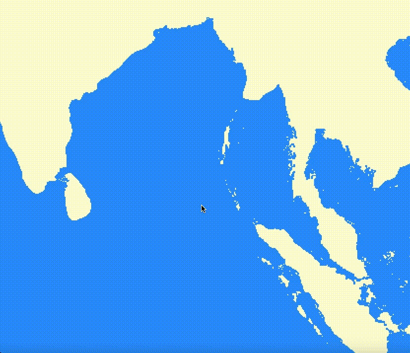

# Opis Projektu

Oil Spill Model to symulacja wycieku ropy naftowej stworzona w ramach przedmiotu Symulacja Systemów Dyskretnych, która ma na celu zobrazowanie rozprzestrzeniania się wycieku ropy oraz jej wpływu na środowisko. Symulacja jest oparta na rzeczywistyh danych dotyczących prądów morskich w obszarze Zatoki Bengalskiej. 

## Instalacja

### Wymagania

- Python 3.x
- Biblioteki zewnętrzne wymienione w pliku `requirements.txt`

### Instrukcje Instalacji

1. Sklonuj repozytorium:

   ```bash
   git clone https://github.com/JakubG-git/oil-spill-model.git
   ```
2. Przejdź do katalogu z projektem:

   ```bash
   cd oil-spill-model
   ```
3. Zalecane jest użycie wirtualnego środowiska Pythona:

   ```bash
   python3 -m venv venv
   source venv/bin/activate
   ```
4. Zainstaluj wymagane biblioteki:

   ```bash
    pip install -r requirements.txt
    ```

## Uruchomienie
Aby uruchomić symulację należy wykonać polecenie:
```bash
python main.py
```
Narysuj myszką obszar wycieku ropy. Klawisz 'space' rozpoczyna i pauzuje symulację. 

## Przykładowa symulacja


## Autorzy
W razie pytań, sugestii lub problemów zapraszamy do kontaktu:
- [Maciej Adamus](https://github.com/maciad)
- [Jakub Głowacki](https://github.com/JakubG-git)
- [Hubert Asztabski](https://github.com/Sztaba)

## Pełna dokumentacja
